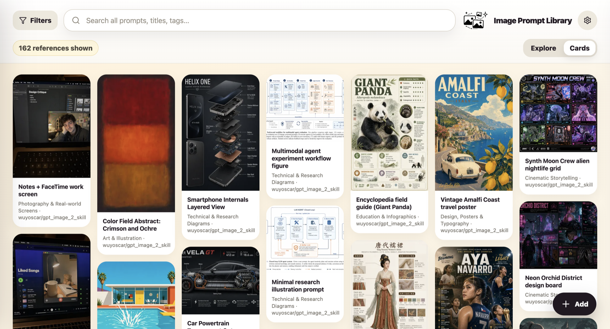
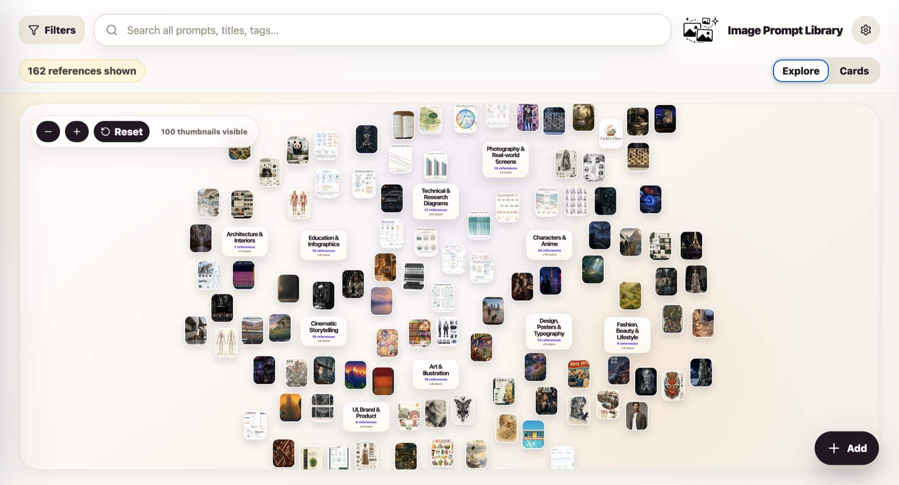
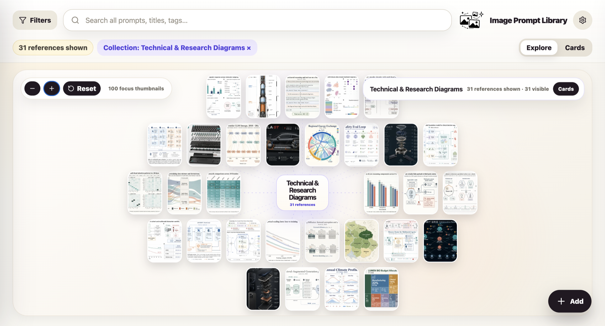
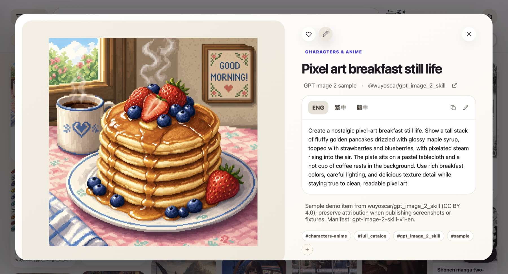

# Image Prompt Library

[](https://github.com/EddieTYP/image-prompt-library/actions/workflows/ci.yml)
[](https://github.com/EddieTYP/image-prompt-library/actions/workflows/pages.yml)
[](https://github.com/EddieTYP/image-prompt-library/releases/tag/v0.2.0-alpha)
[](LICENSE)

ChatGPT image generation has become good enough that the prompts are worth keeping. The problem is that once you start saving great outputs, screenshots, and variations, there still is not a simple private tool for managing image prompts like a real reference library.

**Image Prompt Library** is a local-first web app for collecting generated images and the prompts behind them. When you create an image worth reusing, save it into your own self-hosted library, add the prompt, organize it into collections and tags, and search it later as a quick visual reference.

Your library stays on your own machine: local SQLite, local image files, no accounts, no cloud sync, and no hosted database required.

**Online sandbox:** <https://eddietyp.github.io/image-prompt-library/> — a read-only GitHub Pages version chooser using public sample prompts. The current 0.2 preview is available at <https://eddietyp.github.io/image-prompt-library/v0.2/>, with the original 0.1 alpha archived at <https://eddietyp.github.io/image-prompt-library/v0.1/>. Sandbox images are compressed for web preview; run the app locally to create your own private full library.

**Alpha release:** <https://github.com/EddieTYP/image-prompt-library/releases/tag/v0.2.0-alpha> — refreshes Cards browsing, mobile layout behavior, adaptive image display, and versioned public previews.

**Roadmap:** See [`ROADMAP.md`](ROADMAP.md) for follow-up work around mobile Explore, management flows, packaging, and public release polish.



The 0.2 preview refreshes the browsing experience across desktop and mobile: image-first Cards, cleaner detail behavior, versioned public demos, and phone-specific layout improvements.

## What it does

- Save generated/reference images together with the prompt text that created them.
- Organize references into collections and tags so good prompts are easy to find again.
- Browse visually in **Explore view**, a thumbnail constellation that spreads images by collection in a style inspired by graph tools like Obsidian.
- Browse densely in **Cards view**, an image-first masonry gallery for scanning many prompt references quickly on desktop and mobile.
- Search across titles, prompts, tags, collections, sources, and notes.
- Filter by collection, open a detail view, and copy the prompt with one click.
- Keep everything local for privacy and long-term ownership.

## Screenshots

The screenshots below show the main browsing and detail flows. The 0.2 preview also adds phone-specific behavior for Cards browsing, filtering, and detail viewing.

### Browse with image-first cards

Cards view is designed for fast visual scanning. In the 0.2 preview, cards use an image-first layout with a clean title overlay, quick actions, and adaptive image display for mixed portrait, landscape, and tall reference images.


### Mobile-first browsing behavior

On phones, the app defaults to Cards view, uses a stable two-column masonry layout, keeps quick actions touch-visible, and moves the selected collection into a bottom dock instead of crowding the header.

### Explore your prompt library visually

Explore view gives you a spatial overview of your library. Collections become visual hubs, with image thumbnails arranged around them so you can scan patterns, styles, and prompt families at a glance.



### Focus on one collection

Filters let you focus the same visual map on a single collection while keeping search, collection context, and the view switcher close at hand.



### Keep the prompt beside the image

The detail view keeps the large image preview, prompt, language tabs, attribution, notes, tags, favorite/edit actions, and one-click prompt copy in one place. On mobile, the detail view becomes image-first with floating controls over the image.



## Features

- Local SQLite database and local image files.
- Image storage with originals, previews, and thumbnails.
- Explore mode: thumbnail constellation view for visual browsing.
- Cards mode: image-first masonry/Pinterest-style prompt gallery.
- Search across titles, prompts, tags, collections, sources, and notes.
- Collections and tags for organizing references.
- Detail modal with lightweight inline editing, prompt language tabs, and copy feedback.
- Add/edit modal with English, Traditional Chinese, and Simplified Chinese prompt fields plus metadata.
- Result image and optional reference image uploads.
- Phone-friendly Cards behavior: two-column masonry, compact header, touch-visible actions, and bottom selected-collection dock.
- Adaptive card/detail image display for mixed portrait, landscape, and tall reference images.

## Requirements

- Python 3.10+
- Node.js 20+ recommended
- npm

## Platform support

- macOS and Linux are the primary supported local-install targets today.
- Windows can run the app stack through **WSL 2** using the same commands as Linux.
- Native Windows PowerShell/CMD is not a supported quick-start path yet because the current helper scripts are Bash scripts and assume Unix-style virtualenv paths such as `.venv/bin/activate`. Native Windows support should use equivalent PowerShell scripts or a Docker/Compose path in a future pass.

## Quick start

```bash
git clone https://github.com/EddieTYP/image-prompt-library.git
cd image-prompt-library
./scripts/setup.sh
./scripts/start.sh
```

Open <http://127.0.0.1:8000/>.

`scripts/start.sh` builds the frontend and serves the built app through FastAPI, so normal local use only needs one server.

## Development mode

For frontend/backend development with Vite hot reload:

```bash
./scripts/dev.sh
```

Open <http://127.0.0.1:5177/>.

Default development ports:

- Backend API: <http://127.0.0.1:8000>
- Vite frontend: <http://127.0.0.1:5177>

## Configuration

Copy `.env.example` to `.env` and edit if needed:

```bash
cp .env.example .env
```

Important settings:

```bash
IMAGE_PROMPT_LIBRARY_PATH=./library
BACKEND_HOST=127.0.0.1
BACKEND_PORT=8000
FRONTEND_PORT=5177
BACKUP_DIR=./backups
```

`IMAGE_PROMPT_LIBRARY_PATH` controls where your private database and images live. The default `./library` is repo-local and intentionally ignored by git. For long-term personal use, you may prefer a durable path such as `~/ImagePromptLibrary`.

If you want the new AI prompt skeleton/rewrite flow, also configure the optional n8n webhook variables after importing the workflows in [`automation/n8n`](automation/n8n):

```bash
IMAGE_PROMPT_TEMPLATE_INIT_WEBHOOK_URL=
IMAGE_PROMPT_TEMPLATE_GENERATE_WEBHOOK_URL=
IMAGE_PROMPT_TEMPLATE_WORKFLOW_TOKEN=
IMAGE_PROMPT_TEMPLATE_WORKFLOW_TOKEN_HEADER=X-Image-Prompt-Workflow-Token
IMAGE_PROMPT_TEMPLATE_TIMEOUT_SECONDS=45
```

If you set `IMAGE_PROMPT_TEMPLATE_WORKFLOW_TOKEN`, export the same token before running `./scripts/sync-n8n-prompt-workflows.sh` so the auth gate is embedded into the synced n8n workflows.

You can sync the bundled n8n workflows into your instance with:

```bash
./scripts/sync-n8n-prompt-workflows.sh
```

For server-side Nanobanana Internal Image API generation, configure these only in the backend/server environment:

```bash
NANOBANANA_IMAGE_API_BASE_URL=https://image-api.wendealai.com
NANOBANANA_IMAGE_API_TOKEN=
NANOBANANA_IMAGE_CALLBACK_URL=
```

The token must not be exposed through Vite/frontend environment variables. After setting `NANOBANANA_IMAGE_API_TOKEN`, run a live smoke with:

```bash
python scripts/nanobanana-live-smoke.py
```

## Data layout

Runtime data lives under `IMAGE_PROMPT_LIBRARY_PATH`:

```text
library/db.sqlite       SQLite metadata and full-text search index
library/originals/      original uploaded/imported images
library/previews/       generated preview images
library/thumbs/         generated thumbnail images
```

Do not commit runtime `library/` data to git. It is your private prompt/image collection.

## Add your own prompts

1. Start the app.
2. Click `+ Add`.
3. Add a title, prompt text, collection, optional tags, and a required result image.
4. Save the card.
5. Use Cards/Explore, search, filters, and detail view to browse and copy prompts later.

## Import and example data

The app starts with an empty private library. Your own `library/` folder contains personal prompt data and images, so it is intentionally ignored by git.

### Try the sample library

If you want to see the app with example content, install the optional sample library:

```bash
./scripts/install-sample-data.sh en
```

Then start the app and open <http://127.0.0.1:8000/>.

The installer downloads the sample image ZIP from the public `sample-data-v1` release and verifies its SHA256 checksum before import. The sample library is based on [`wuyoscar/gpt_image_2_skill`](https://github.com/wuyoscar/gpt_image_2_skill), licensed under **CC BY 4.0**. It is included only as demo/sample content; your own prompt library data remains private and is not part of the sample bundle.

### Import the bundled demo cases

If you want the compressed, read-only demo cases shipped in this repository, import the bundled `demo-data` snapshot instead:

```bash
./scripts/import-demo-data.py
```

That command imports the repo-local `frontend/public/demo-data/` bundle. The current bundle combines the `wuyoscar/gpt_image_2_skill` sample set with a curated `freestylefly/awesome-gpt-image-2` case 310-361 extension.

To import the exact archived GitHub Pages `v0.1` demo cases directly from the public site:

```bash
./scripts/import-demo-data.py --public-v0.1
```

Both paths preserve the public demo attribution/source metadata while loading the cases into your private local `library/`.

## Backup

Create a timestamped backup archive:

```bash
./scripts/backup.sh
```

The backup includes:

- `library/db.sqlite`
- `library/originals/`
- `library/thumbs/`
- `library/previews/`

Restore by stopping the app, extracting the archive, and replacing the corresponding library directory contents. Keep backups somewhere outside the repo if the library matters to you.

## GitHub Pages sandbox

The repository also ships static read-only demos for GitHub Pages:

```bash
npm run build:demo
npm run build:demo:v0.2
```

The public Pages deployment is versioned:

- `/` — version chooser
- `/v0.2/` — current 0.2 preview
- `/v0.1/` — archived 0.1 alpha demo

The demos read public sample metadata from `frontend/public/demo-data/`, use compressed WebP preview images, and disable write actions. They are intended only as online sandboxes; run the local app to create and manage your own private prompt library.

## Verification

Run backend/API/static tests:

```bash
source .venv/bin/activate
python -m pytest -q
```

Build the frontend:

```bash
npm run build
```

Smoke-test a running local server:

```bash
./scripts/smoke-test.sh
```

## License and allowed use

Image Prompt Library's core application code is open source under **AGPL-3.0-or-later**. Copyright (C) 2026 Edward Tsoi. See `NOTICE` for the project copyright notice and `LICENSE` for the full AGPL text.

Commercial licenses are available for organizations that want to use, modify, or host Image Prompt Library under terms outside the AGPL. Contact the maintainer if you need proprietary hosted-product terms or other non-AGPL licensing.

Sample data and third-party assets are licensed separately and retain their original attribution/license terms. The optional sample bundle currently preserves `wuyoscar/gpt_image_2_skill` / **CC BY 4.0** attribution; the repo-local online demo bundle also preserves `freestylefly/awesome-gpt-image-2` / **MIT** attribution for cases 310-361. Do not treat sample prompts/images as part of the app-code AGPL grant.

Your own local prompt library data remains yours and should not be committed to this repository.

## Privacy and security model

- The app is local-first and stores data on your device.
- There are no user accounts or built-in cloud sync.
- The `/media` route only serves image media directories and should not expose the SQLite database or internal files.
- Binding to `127.0.0.1` keeps the app local to your machine. Only change the host if you understand the LAN exposure implications.

## Troubleshooting

### `./scripts/start.sh` cannot find Python dependencies

Run setup first:

```bash
./scripts/setup.sh
```

### Port already in use

Change `.env`:

```bash
BACKEND_PORT=8001
FRONTEND_PORT=5178
```

Then restart the app.

### Empty library after first start

That is expected for a fresh install. Click `+ Add` to create your first prompt card, or install the optional sample library if you want demo content first.

### Images or database missing after moving folders

Check `IMAGE_PROMPT_LIBRARY_PATH` in `.env`. Your database and image folders must stay together.

## Project status

This is an alpha local-first app. Core browse/search/filter/detail/copy/add/edit flows exist, the public read-only sandbox is versioned, and the 0.2 preview improves both desktop and mobile browsing. Remaining work includes deeper mobile Explore gestures, management-flow polish, packaging, and public-release hardening.

See `ROADMAP.md` for the current roadmap and follow-up priorities.

## Repository layout

```text
backend/                 FastAPI app, SQLite migrations, repositories, services, routers
frontend/                Vite/React app
library/                 Local runtime data, ignored except .gitkeep placeholders
scripts/dev.sh           Backend + Vite development mode
scripts/setup.sh         Local setup helper
scripts/start.sh         Single-service local mode
scripts/backup.sh        Timestamped local data backup
scripts/smoke-test.sh    Basic running-server smoke test
tests/                   Backend/API/static regression tests
```
